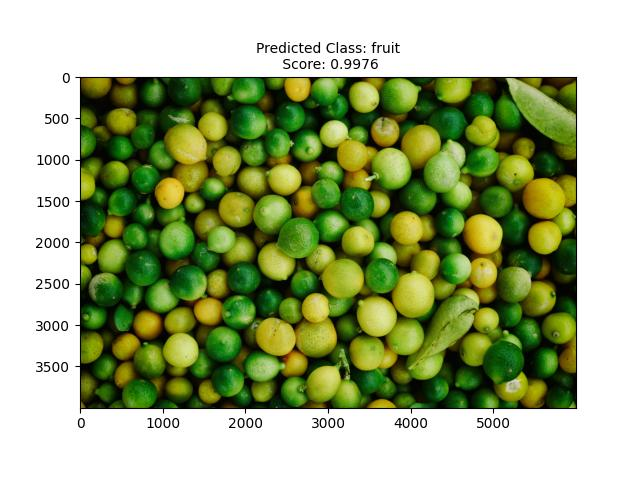
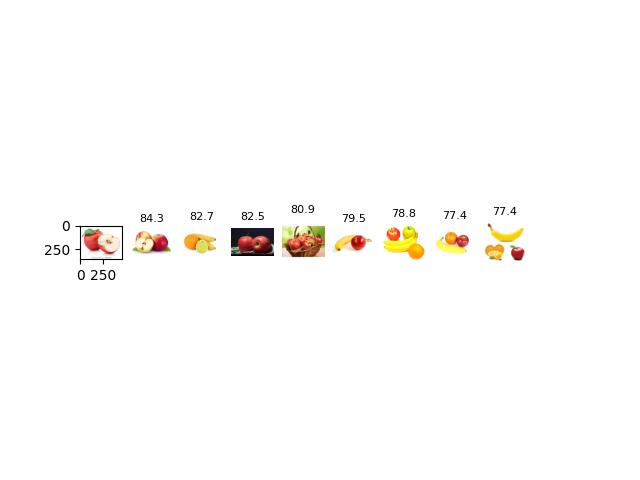
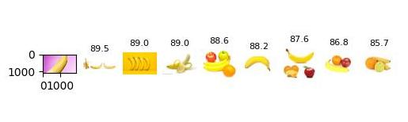

Fast entry to CLIP multimodal & foundational model's setup and usage for zero-shot image classification and image retrieval tasks.


## Setup

### Anaconda Environment

```
conda create --name CLIP python=3.8.19
conda activate CLIP
conda install --yes -c pytorch pytorch=1.7.1 torchvision cudatoolkit=11.0
pip install ftfy regex tqdm matplotlib
pip install git+https://github.com/openai/CLIP.git

```

### Docker

```
docker build . -t clip:1.0
bash run_docker.sh
cd CLIP
```

* Modify the CLIP folder path according to your path in run_docker.sh

* You may need different versions of CUDA & PytTorch according to your hardware settings, modify the conda command or .Docker file according to this.

## Zero-shot Classification

```
python scripts/classification.py --input_dir dataset/classification --classnames_file dataset/classnames.txt --outDir outputs/classification
```

The above command runs CLIP for zero-shot classification over the input images with the classnames given in classnames.txt and save the input image with its predicted class and prediction score as a plot in the given output directory.  



## Image Retrival

```
python scripts/image_retrieval.py --gallery-path dataset/gallery --query-path dataset/query --outDir outputs/retrieval
```

Image retrieval is a task to retrieve the most similar images to a given query  input image.

The command uses retrieval script with the example gallery and query dataset that you can find in this repository and save the top-10 retrieved images with their similarity scores to the query image as a plot. 





